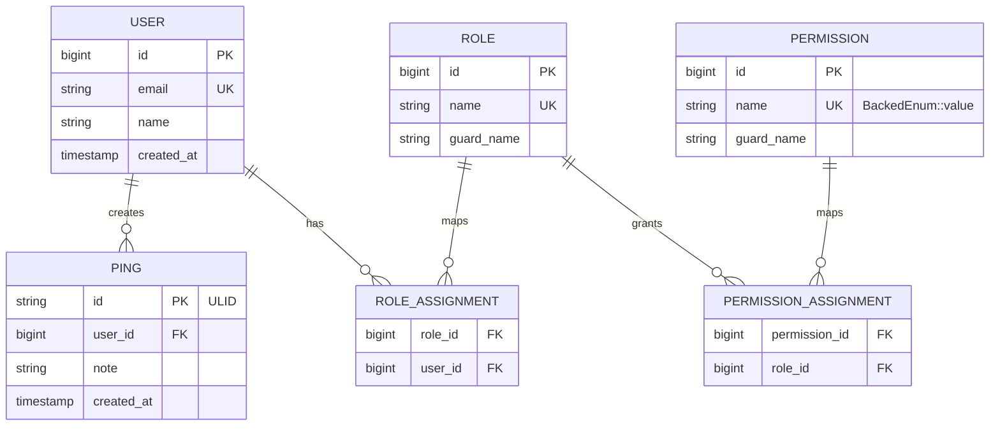

# EuroStrip — Architecture overview

> Web flight strips for EuroScope.

EuroStrip is a web companion for EuroScope: controllers point the
euroscope-websocket-connector plugin at this backend (JSON Contract
Protocol v1 over HTTPS long-poll) and interact with their session from
the browser — live flight data, protocol commands, and eventually
flight strips.

This doc orients you in 2 minutes. Each box below has its own deep-dive.

## Topology

```mermaid
flowchart LR
  Browser([Browser])

  subgraph Frontend["Frontend (apps/web)"]
    Next[Next.js 15<br/>App Router]
    Proxy[/api/proxy/*<br/>httpOnly cookie/]
  end

  subgraph Backend["Backend (apps/backend)"]
    Octane[FrankenPHP<br/>Octane workers]
    Bus[CQRS bus<br/>Authorize→Validate→Tx]
    Filament[Filament /admin]
    Scramble[Scramble /docs/api]
    Horizon[Horizon worker]
  end

  subgraph Stores["Data stores"]
    PG[(Postgres 16<br/>+ PostGIS)]
    DF[(Dragonfly<br/>Redis-compatible)]
    TS[(Typesense)]
    S3[(MinIO<br/>S3-compatible)]
  end

  subgraph Realtime["Realtime"]
    Soketi[Soketi<br/>Pusher protocol]
  end

  Browser <-->|HTTP/WS| Next
  Browser <-->|WSS| Soketi
  Next --> Proxy
  Proxy -->|Bearer| Octane
  Octane --> Bus
  Bus --> PG
  Bus --> DF
  Bus --> TS
  Bus --> S3
  Bus -->|broadcast| Soketi
  Filament --- Octane
  Scramble --- Octane
  Horizon --> DF
  Horizon --> PG
```

## Stack at a glance

| Layer       | Tech                                                   | Where                                                  |
| ----------- | ------------------------------------------------------ | ------------------------------------------------------ |
| Frontend    | Next.js 15 (App Router), Redux Toolkit, next-intl      | `apps/web/`                                            |
| API         | Laravel 13 + Octane/FrankenPHP, pure CQRS, Spatie Data | `apps/backend/`                                        |
| Admin       | Filament v4 at `/admin`                                | `apps/backend/app/Modules/*/Presentation/Filament/`    |
| API docs    | Scramble at `/docs/api` (regenerated on every boot)    | `apps/backend/` (auto)                                 |
| Auth        | Passport (Bearer) + Socialite (stub provider in dev)   | `apps/backend/app/Auth/`, `apps/web/src/app/api/auth/` |
| Realtime    | Soketi (Pusher protocol)                               | `infra/docker-compose.yml`                             |
| Search      | Typesense via Laravel Scout                            | `apps/backend/config/scout.php`                        |
| Queue/Cache | Dragonfly (Redis-compatible) + Horizon                 | `infra/docker-compose.yml`                             |
| Storage     | MinIO (S3-compatible)                                  | `infra/docker-compose.yml`                             |
| Mail (dev)  | Mailpit                                                | `infra/docker-compose.yml`                             |
| DB          | Postgres 16 + PostGIS 3.4                              | `infra/docker-compose.yml`                             |

## Domain model (current)

The model is intentionally tiny. Phase 1–4 carry only the seed entities
needed to exercise auth, modules, search, and realtime end-to-end.
Aircraft, Maintenance, and Logbook land in later phases.

## Request shape

A typical write request flows: Browser → Next.js proxy (httpOnly cookie
attached as Bearer) → Laravel route → Controller → Bus dispatch
(Command) → Middleware pipeline (Logging → Metrics → Authorize →
Validate → Transaction) → Handler → Repository → Postgres. Read
requests skip Transaction. Realtime broadcasts go Postgres write →
event listener → Pusher → Soketi → connected browsers.

## Where to go next

- **CQRS layer specifics** — [`cqrs.md`](./cqrs.md)
- **Auth (Passport + Socialite + permissions)** — [`auth.md`](./auth.md)
- **Data stores** — [`data-stores.md`](./data-stores.md)
- **Frontend (Next.js + Redux + theming)** — [`frontend.md`](./frontend.md)
- **Monorepo layout (apps, libs, Nx graph)** — [`monorepo-layout.md`](./monorepo-layout.md)
- **Decisions log** — [`../adr/`](../adr/)
- **Local dev** — [`../runbooks/local-dev.md`](../runbooks/local-dev.md)
- **Adding a feature** — [`../runbooks/adding-a-feature.md`](../runbooks/adding-a-feature.md)
